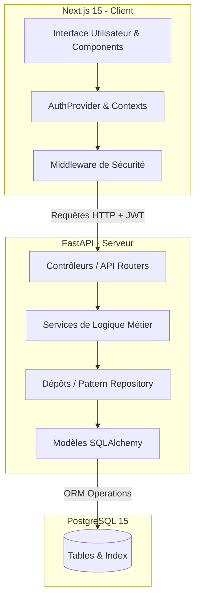
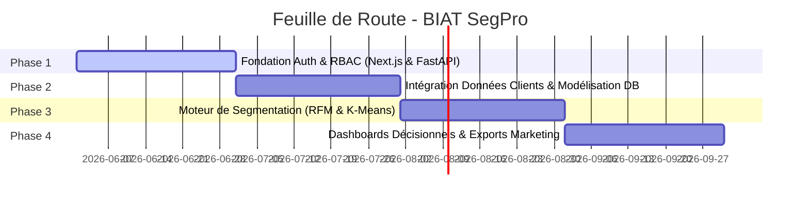

# BIAT SegPro — Plateforme Intelligente de Segmentation Clientèle pour la Banque de Détail

BIAT SegPro est une plateforme d'intelligence d'affaires et de segmentation de la clientèle conçue spécifiquement pour la **BIAT (Banque Internationale Arabe de Tunisie)**. Conçue pour les analystes de la banque de détail et les administrateurs, elle établit une base modulaire, sécurisée et extensible (architecture MVC) pour l'exécution de modèles de clustering statistiques et basés sur l'intelligence artificielle.

---

## 🎯 Vision et Objectifs du Projet

Dans le secteur bancaire de détail, la compréhension fine des comportements des clients est essentielle pour maximiser la valeur et personnaliser l'offre. **BIAT SegPro** fournit aux analystes de la banque de détail des outils puissants pour segmenter le portefeuille clients à l'aide de critères statistiques (modèle RFM) et d'algorithmes d'apprentissage automatique (Clustering K-Means, etc.).

La plateforme offre une séparation claire des rôles :
*   **Administrateurs :** Gestion de la plateforme, contrôle des accès et supervision des intégrations de données.
*   **Analystes de Banque de Détail :** Création, exécution et analyse des campagnes de segmentation, exploration des profils clients et exportation des cohortes cibles.

---

## 🏗️ Architecture du Système

Le projet utilise une architecture moderne et modulaire basée sur le modèle MVC (Modèle-Vue-Contrôleur) avec une séparation stricte entre le client (Frontend) et le serveur (Backend).



---

## 🚀 Démarrage Rapide (Docker Compose)

L'ensemble de l'écosystème est conteneurisé et peut être lancé avec une seule commande.

### Prérequis
*   [Docker](https://www.docker.com/get-started) installé et en cours d'exécution.
*   [Docker Compose](https://docs.docker.com/compose/install/).

### Lancement de l'Application
Exécutez la commande suivante à la racine du projet :

```bash
docker-compose up --build
```

Cette commande démarre :
1.  **Base de données PostgreSQL 15** sur le port `5432` (avec configuration automatique de vérification de santé).
2.  **Backend FastAPI** sur le port `8000` (avec alimentation automatique des schémas de base de données et des utilisateurs d'exemple).
3.  **Frontend Next.js 15** sur le port `3000` (serveur de développement avec rechargement à chaud).

### Comptes d'accès par défaut pour les tests
Lors du démarrage, la base de données est automatiquement alimentée avec les comptes suivants :

| Rôle | Email | Mot de passe |
| :--- | :--- | :--- |
| **Administrateur** | `admin@biat.com.tn` | `admin1234` |
| **Analyste de Banque de Détail** | `analyst@biat.com.tn` | `analyst1234` |

---

## 🛠️ Stack Technique

### Frontend
*   **Framework :** Next.js 15 (App Router, Server & Client Components)
*   **Langage :** TypeScript (Type-safe)
*   **Styling :** Tailwind CSS v4 (Palette de couleurs personnalisée pour la BIAT)
*   **Formulaires & Validation :** React Hook Form & Zod
*   **Client API :** Axios (Avec intercepteurs automatiques pour la gestion des tokens)
*   **Gestion des Sessions :** Cookies sécurisés HTTP-only gérés via un Middleware Next.js

### Backend
*   **Framework :** Python, FastAPI
*   **ORM :** SQLAlchemy (Declarative Base 2.0 Mapping)
*   **Migrations :** Alembic (Structure préconfigurée)
*   **Validation :** Pydantic v2
*   **Sécurité :** JWT (python-jose), chiffrement des mots de passe avec `bcrypt` (sécurisé et optimisé pour Python 3.13)

### Base de Données
*   **Moteur :** PostgreSQL 15

---

## 📁 Structure du Projet

Le projet respecte une structure MVC rigoureuse pour isoler les routes, la logique métier, la persistance des données et le rendu de l'interface utilisateur.

```text
BIAT SegPro/
├── docker-compose.yml             # Orchestration des conteneurs Docker
├── README.md                      # Documentation principale de la plateforme
├── backend/                       # Application Python FastAPI
│   ├── Dockerfile                 # Build d'image Python 3.13 de base slim
│   ├── requirements.txt           # Dépendances Python
│   ├── .env                       # Variables d'environnement locales
│   └── app/
│       ├── config/                # Configuration de l'application (BaseSettings)
│       ├── database/              # Initialisation de la session et du moteur SQLAlchemy
│       ├── models/                # Schémas de base de données (Modèles SQLAlchemy)
│       ├── schemas/               # Validateurs DTO de requêtes/réponses (Pydantic v2)
│       ├── repositories/          # Opérations CRUD directes (Pattern Repository)
│       ├── services/              # Logique métier et validations (Couche Service)
│       ├── controllers/           # API Routers et définitions des routes
│       ├── utils/                 # Utilitaires de sécurité (Mots de passe & Tokens JWT)
│       └── main.py                # Point d'entrée FastAPI (CORS, seeder de démarrage)
│
└── frontend/                      # Application Client Next.js 15
    ├── Dockerfile                 # Build de l'image de développement Node
    ├── package.json               # Dépendances frontend
    ├── tsconfig.json              # Règles de compilation TypeScript
    ├── postcss.config.mjs         # Processeur Tailwind
    └── src/
        ├── app/                   # App Router (pages de connexion, tableaux de bord)
        ├── components/            # Composants UI réutilisables
        ├── context/               # Contexte d'authentification global (AuthProvider)
        ├── hooks/                 # Hooks React réutilisables
        ├── services/              # Instance Axios et services d'API
        ├── types/                 # Déclarations des types TypeScript
        └── middleware.ts          # Middleware de sécurité pour le routage côté serveur
```

---

## 🔌 Référence de l'API REST

Le backend expose des points de terminaison OpenAPI entièrement validés. Une fois les conteneurs démarrés, vous pouvez accéder à la documentation interactive sur :
👉 **[http://localhost:8000/api/docs](http://localhost:8000/api/docs) (Swagger)**  
👉 **[http://localhost:8000/api/redoc](http://localhost:8000/api/redoc) (ReDoc)**

### Points d'accès d'authentification

#### `POST /api/auth/login`
Authentifie les identifiants de l'utilisateur et génère un jeton de session JWT.
*   **Corps de la requête :**
    ```json
    {
      "email": "analyst@biat.com.tn",
      "password": "analyst1234"
    }
    ```
*   **Réponse (200 OK) :** Retourne les détails du jeton, le rôle de l'utilisateur et ses métadonnées de profil.

#### `POST /api/auth/logout`
Met fin à la session de l'utilisateur.
*   **En-têtes :** `Authorization: Bearer <token>`
*   **Réponse (200 OK) :** Message de succès.

#### `GET /api/auth/me`
Récupère le profil de l'analyste ou de l'administrateur connecté.
*   **En-têtes :** `Authorization: Bearer <token>`
*   **Réponse (200 OK) :** Détails de l'utilisateur connecté.

---

### Administration des Utilisateurs

#### `POST /api/users`
Crée un nouveau compte utilisateur (Analyste ou Administrateur).
*   **Règle d'accès :** Limité au rôle `Administrator`.
*   **Corps de la requête :**
    ```json
    {
      "first_name": "Hamdi",
      "last_name": "Gharbi",
      "email": "hamdi.gharbi@biat.com.tn",
      "password": "securepassword123",
      "role": "Retail Banking Analyst"
    }
    ```
*   **Réponse (201 Created) :** Détails de l'utilisateur créé (sans le mot de passe haché).

#### `GET /api/users`
Récupère la liste de tous les utilisateurs enregistrés sur la plateforme.
*   **Règle d'accès :** Requiert une session authentifiée.
*   **Réponse (200 OK) :** Tableau d'objets utilisateur.

---

### Points d'accès de Santé (Health Check)

#### `GET /health`
Retourne l'état de l'instance de l'API et de la connexion à la base de données.
*   **Réponse (200 OK) :** `{"status": "healthy", "service": "BIAT SegPro"}`

---

## 🔒 Standards de Sécurité Implémentés

1.  **Gestion de Session JWT :** Sessions d'authentification sans état (stateless) avec expiration automatique des tokens après 24 heures.
2.  **Hachage Robuste des Mots de Passe :** Utilisation de l'algorithme `bcrypt` pour sécuriser les mots de passe stockés en base de données.
3.  **Contrôle d'Accès Basé sur les Rôles (RBAC) :** Les routes sensibles telles que `/api/users` sont restreintes aux utilisateurs ayant le rôle `Administrator` au niveau du frontend (Middleware Next.js) et du backend (Dépendances de sécurité FastAPI).
4.  **Assainissement des Entrées :** Toutes les requêtes HTTP entrantes sont validées à l'aide de schémas Pydantic côté backend et de schémas Zod côté client.
5.  **Protocole CORS :** Restrictions sur les en-têtes et les domaines d'origine autorisés pour sécuriser les requêtes provenant du navigateur.

---

## 📅 Feuille de Route (Roadmap)



*   **Phase 1 : Fondation (Complétée)** — Authentification sécurisée, rôles applicatifs, configuration Docker Compose et structure de base MVC.
*   **Phase 2 : Intégration Données** — Conception du pipeline de chargement des données clients de la BIAT et extension du modèle de base de données.
*   **Phase 3 : Moteur de Segmentation** — Implémentation du scoring RFM (Récence, Fréquence, Montant) et intégration de modèles d'IA de clustering non-supervisés.
*   **Phase 4 : Dashboards & Exportation** — Visualisations graphiques riches des segments de clientèle et fonctionnalités d'exportation des listes de ciblage pour les campagnes marketing.
